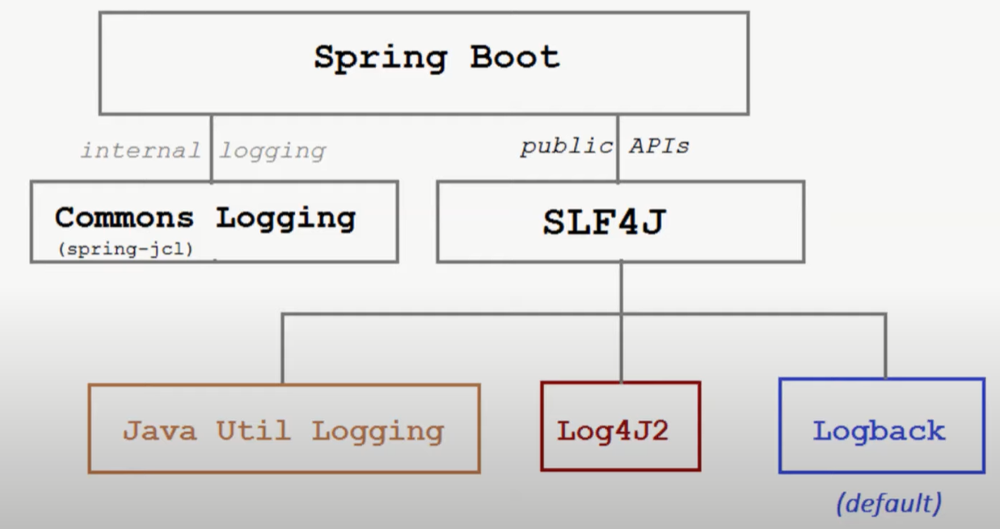

로그, 로깅
# 설정에 대해 정리 잘된곳
https://www.leafcats.com/45
1. dependency 추가
2. application.properties에서 spring.datasource.driverClassName과 spring.datasource.url 설정
3. resources 폴더에 log4jdbc.log4j2.properties 생성
4. resources 폴더에  loback.xml  또는 logback-spring.xml 생성

# log4j
<특징>
1. 속도에 최적화
2. 멀티스레드 안전
3. 계층적 로그설정가능
4. 출력 소스 다양
5. 6가지 로그메세지 레벨
	(① FATAL : 가장 크리티컬한 에러가 일어 났을 때 사용한다.
	② ERROR : 일반 에러가 일어 났을 때 사용한다.
	③ WARN : 에러는 아니지만 주의할 필요가 있을 때 사용한다.
	④ INFO : 일반 정보를 나타낼 때 사용한다.
	⑤ DEBUG : 일반 정보를 상세히 나타낼 때 사용한다.
	⑥ TRACE : 경로추적을 위해 사용한다
	)

<핵심>
Logger 클래스
Appender 출력위치 지정
	(   ConsoleAppender : 콘솔에 로그 메시지를 출력한다.
		FileAppender : 파일에 로그 메시지를 출력한다.
		RollingFileAppender : 로그의 크기가 지정한 용량 이상이 되면 다른 이름의 파일을 출력한다.
		DailyRollingFileAppender : 하루를 단위로 로그 메시지를 파일에 출력한다.
		SMTPAppender : 로그 메시지를 이메일로 보낸다.
		NTEventLogAppender : 윈도우의 이벤트 로그 시스템에 기록한다.
	)
Layout 출력포맷 지정
	(
    %d : 로그의 기록시간을 출력한다.
    %p : 로깅의 레벨을 출력한다.
    %F : 로깅이 발생한 프로그램의 파일명을 출력한다.
    %M : 로깅이 발생한 메소드의 이름을 출력한다.
    %l : 로깅이 발생한 호출지의 정보를 출력한다.
    %L : 로깅이 발생한 호출지의 라인수를 출력한다.
    %t : 로깅이 발생한 Thread명을 출력한다.
    %c : 로깅이 발생한 카테고리를 출력한다.
    %C : 로깅이 발생한 클래스명을 출력한다.
    %m : 로그 메시지를 출력한다.
    %n : 개행 문자를 출력한다.
    %% : %를 출력
    %r : 어플리케이션이 시작 이후부터 로깅이 발생한 시점까지의 시간을 출력한다.(ms)
    %x : 로깅이 발생한 Thread와 관련된 NDC(nested diagnostic context)를 출력한다.
    %X : 로깅이 발생한 Thread와 관련된 MDC(mapped diagnostic context)를 출력한다.

	)

## log4j2는 스프링부트의 기본 로거. @Log4j2만 쓰면 사용할 수 있다.

# SLF4J
“SLF4J“는 “로깅 구현체“라기 보다는 “Logging Facade” 이다.
로깅에 대한 추상 레이어를 제공하는것이고 java로 따지면 interface덩어리

# LogBack
- log4j를 토대로 새롭게 만든 Logging 라이브러리
- logback을 사용하기 위해선 slf4j(simple logging facade for java)를 함께 사용해야 한다.
slf4j를 통해 연관 라이브러리들이 다른 logging framework를 쓰더라도 logback으로 통합할 수 있다.
- 스프링부트는 spring-boot-starter에 포함되어있다. 스프링부트의 디폴트 로거
- 스프링부트라면 src/main/resources 디렉터리에 logback-spring.xml에 설정.  주요 설정요소로는 Logger(레벨, 경로), Appender(어디에 출력할지), Encoder(출력형식)
- Appender는 ConsoleAppender, FileAppender, RollingFileAppender, SMTPAppender, DBAppender 가 있다.
- 예)
	<?xml version="1.0" encoding="UTF-8"?>
	<configuration debug="true">

		<!-- Appenders -->
		<appender name="console" class="ch.qos.logback.core.ConsoleAppender">
			<encoder>
				<Pattern>%d %5p [%c] %m%n</Pattern>
			</encoder>
		</appender>

		<appender name="console-infolog" class="ch.qos.logback.core.ConsoleAppender">
			<encoder>
				<Pattern>%d %5p %m%n</Pattern>
			</encoder>
		</appender>

		<!-- Logger -->
		<logger name="com.board" level="DEBUG" appender-ref="console" />
		<logger name="jdbc.sqlonly" level="INFO" appender-ref="console-infolog" />
		<logger name="jdbc.resultsettable" level="INFO" appender-ref="console-infolog" />

		<!-- Root Logger -->
		<root level="off">
			<appender-ref ref="console" />
		</root>
	</configuration>
- 로그타입
	- sqlonly
	SQL을 로그로 남기며, Prepared Statement와 관련된 파라미터는 자동으로 변경되어 SQL을 출력합니다.
	- sqltiming
	SQL과 SQL 실행 시간(milliseconds 단위)을 출력합니다.
	- audit
	ResultSet을 제외한 모든 JDBC 호출 정보를 출력합니다.
	JDBC 관련 문제를 추적하는 경우를 제외하고는 사용이 권장되지 않습니다.
	- resultset
	ResultSet을 포함한 모든 JDBC 호출 정보를 출력합니다.
	- resultsettable
	SQL 조회 결과를 테이블 형태로 출력합니다.
	- connection
	Connection의 연결과 종료에 관련된 로그를 출력합니다.

커넥션 누수 문제 해결에 도움이 됩니다.
- <장점>
①log4j보다 약 10배 정도 빠르게 수행되도록 내부가 변경되었으며, 메모리 효율성도 좋아졌다.
②log4j때부터 광범위한 테스트를 진행한 경험을 가지고 있으며, logback은 더욱 높은 레벨의 테스트를 통해 검증되었다.
③문서화가 잘 되어 있다.
④설정 파일을 변경하였을 경우, 서버 재기동 없이 변경 내용이 자동으로 갱신된다.
⑤서버 중지 없이 I/O Faliure에 대한 복구를 지원한다.
⑥RollingFileAppender를 사용할 경우 자동적으로 오래된 로그를 지워주며 Rolling 백업을 처리한다

- <준비물>
우선 필수적으로 총 3개의 모듈이 필요합니다.
logback-core.jar
logback-classic.jar
slf4j-api.jar
세 파일은 아래의 링크에서 다운받을 수 있습니다. (난 1.2.7)(1.8.0beta)
http://logback.qos.ch/download.html
http://www.slf4j.org/download.html

<기본템플릿>
package src;

import org.slf4j.Logger;
import org.slf4j.LoggerFactory;

public class Main {

	//main이라서 static사용
    private static Logger logger = LoggerFactory.getLogger(Main.class);

    public static void main(String[] args) {
        logger.trace("trace");
        logger.debug("debug");
        logger.info("info");
        logger.warn("warn");
        logger.error("error");
    }
}

<설정파일>
- 위치 : **Classpath** 에 위치시켜야 한다.
	만약 기본Classpath가 lib/였다면 lob/logback/logback.xml 과 같이 위치시키면 설정 적용안된다.
	logback.xml파일이 없다면 기본설정을 따르게 된다.
- 기본 소스 http://logback.qos.ch/manual/configuration.html

<에러>
org.slf4j.helpers.noplogger(nop)
=> 실행 파일을 안가져오고 api같은 이상한 파일 갖고왔었음.

### log4jdbc-log4j2
- 기본적으로 Log4j2(또는 평소와 같이 SLF4J)를 사용하도록 log4jdbc를 수정한 것
- https://log4jdbc.brunorozendo.com/
